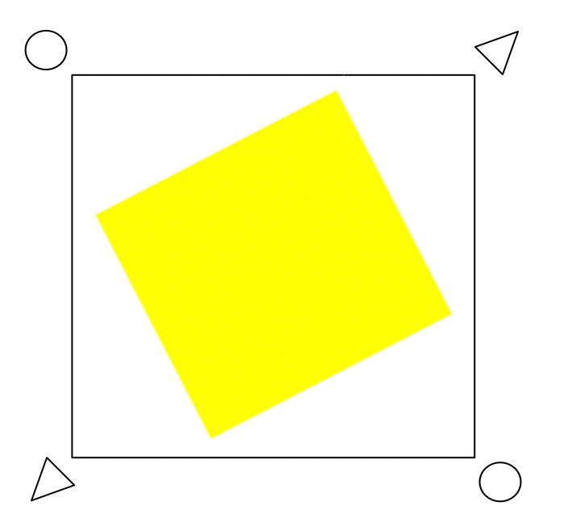

## Manual

** Don't fork, because then other candidates will see your solution :) **

1. clone solution
2. complete the tasks
3. Upload to your repository and send us the link

## Works:

### 1. Custom implementation of the frame of the active object (hereinafter - a graphic element)
** Purpose: Modify the code in such a way that when the graphic element is selected, the border changes from the default (A) to the following (B): **

Note: picture B is only to present the final result, do not be influenced by the proportions or the specific appearance of the icons at the corners (they can be any).

### 2. Ensure that the frame does not rotate with object
** Purpose: The frame should always fully encapsulate the object but not rotate with the object**

For example the frame of a rotated object should look something like this:

### 3. Add a UI button simulating the context menu for the active object (hereinafter - the UI element)
** Purpose: The UI element is intended to control the color of the graphic element. When pressed, the color changes, it can be random.

### 4. Add a unit test to prove that your UI button successfully changes the colour of the active object
** Purpose: Provide basic test coverage for your code.**

## detailed requirements for the above tasks:

1. UI element must be under the control of React framework, graphic element using Fabric
2. padding graphic item:
- borders 10 px from the object,
- icons at the ends of 10 px from the border,
3. graphic element icons:
- 'rotate' action icon - circle
- 'resize' action icon - a triangle showing the resize direction
4. positioning of action icons for a graphic item:
- left-top - rotating the framed object according to the mouse movement
- right-top - scaling the framed object (simultaneously in X and Y) according to the mouse movement
- left-bottom - scaling the framed object (simultaneously in X and Y) according to the mouse movement
- right-bottom - rotating the framed object with the mouse movement
5. the default control for the 'rotate' action (the square at the top in the picture A) is turned off,
6. the default controls for expanding (the squares in the middle of each side in image A) are disabled,
7. UI element can have any form with the possibility of clicking,
8. clicking modifies the color of the active object on the canvas - the color may be random.
9. the graphic element and the UI element are correlated with each other, i.e. the shift of the graphic element causes the UI element to be moved by the same delta.
10. the solution must compile and run in the browser.
11. the running project must contain at least 5 graphic elements and UI elements correlated with them.

## Information on the frameworks used

- React > 16.12
- Fabric > 3.5

## Project launch

1. npm install
2. npm run start
3. [http://localhost:3000](http://localhost:3000).
