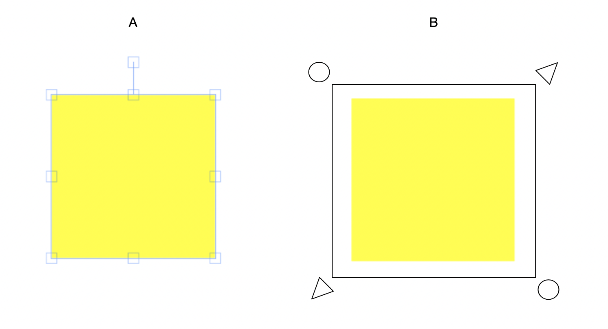
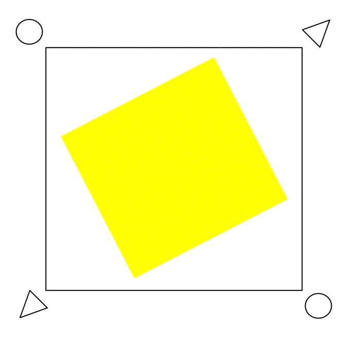
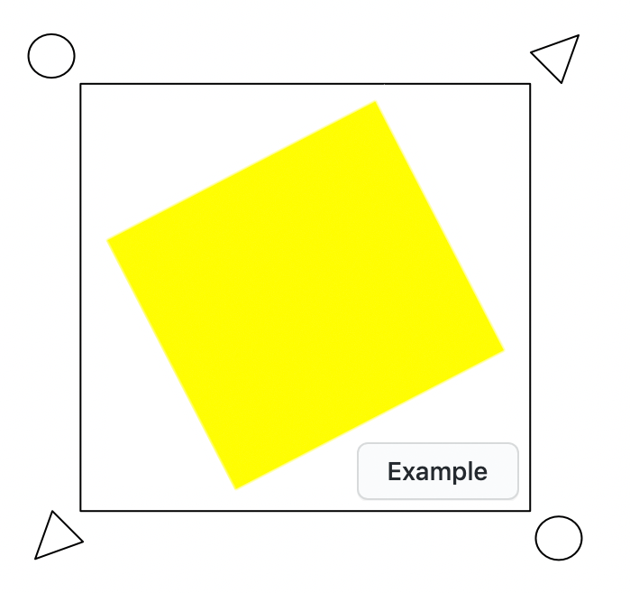

## Instructions

** Please don't fork this repo, because then other candidates will see your solution :) **

1. Clone repo
2. Complete the tasks
3. Upload to your repository and send us the link

## Tasks

### 1. Custom implementation of the frame of the active object (hereinafter - canvas object)
** Purpose: Modify the code in such a way that when the canvas object is selected, the selection frame changes from the Fabric.js default (A) to the custom implementation (B): **

Note: picture B is only to present the final result, do not be influenced by the proportions or the specific appearance of the icons at the corners (they can be any).

 * The canvas object should be implemented in Fabric.js.
 * `10px` padding should be used for the border
 * Control icons (e.g. circles and triangles) should be located `10px` from the border
 * The circles (top left and bottom right) should allow the user to rotate the object using their mouse
 * The triangles (top right and bottom left) should allow the user to scale the object using their mouse
 * Scaling should maintain the object's proportions (i.e. it should not be possible to stretch the object)

### 2. Ensure that the frame does not rotate with the canvas object
** Purpose: The frame should always fully encapsulate the canvas object but not rotate with the canvas object**

For example the frame of a rotated canvas object should look something like this:

### 3. Add a UI button simulating the context menu for the active object (hereinafter - the UI element)
** Purpose: The UI element is intended to control the color of the canvas object. When pressed, the color of the canvas object should change to a random color.

 * The UI element should be implemented in React
 * The button should only be visible when a canvas object is selected
 * It should only change the color of the active canvas object
 * The UI element's position should be locked with the active canvas object's frame (i.e. no need for it to rotate)

For example:

### 4. Add a unit test to prove that your UI element successfully changes the colour of its associated canvas object
** Purpose: Provide basic test coverage for your code.**

 * The unit test framework is your choice
 * It should be possible to run the tests in node, e.g. with `$ npm test`

## Other requirements

 * Please add at least 5 objects to the canvas
 * Your code must compile and run in a modern browser (e.g. Chrome v80+) without any errors

## Information on the frameworks used

- React >= 16.12
- Fabric.js >= 3.5

## Project launch

1. `$ npm install`
2. `$ npm run start`
3. [http://localhost:3000](http://localhost:3000).
